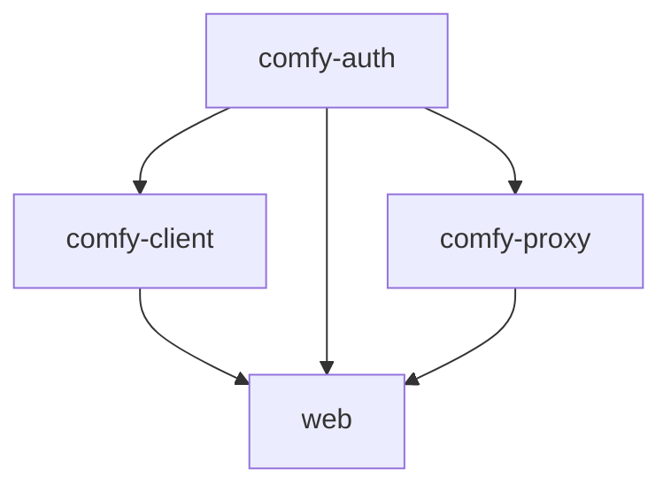
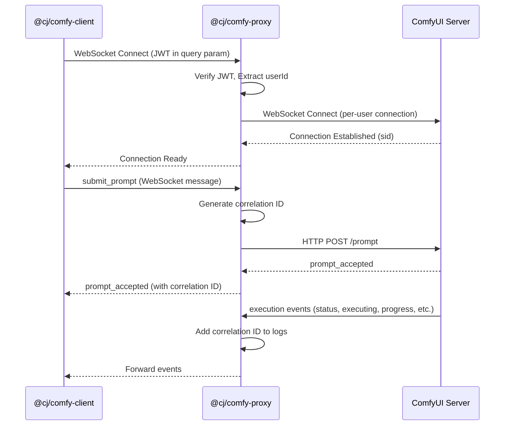
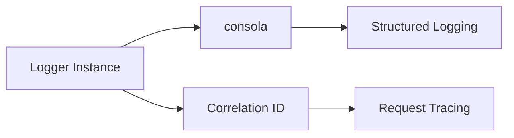
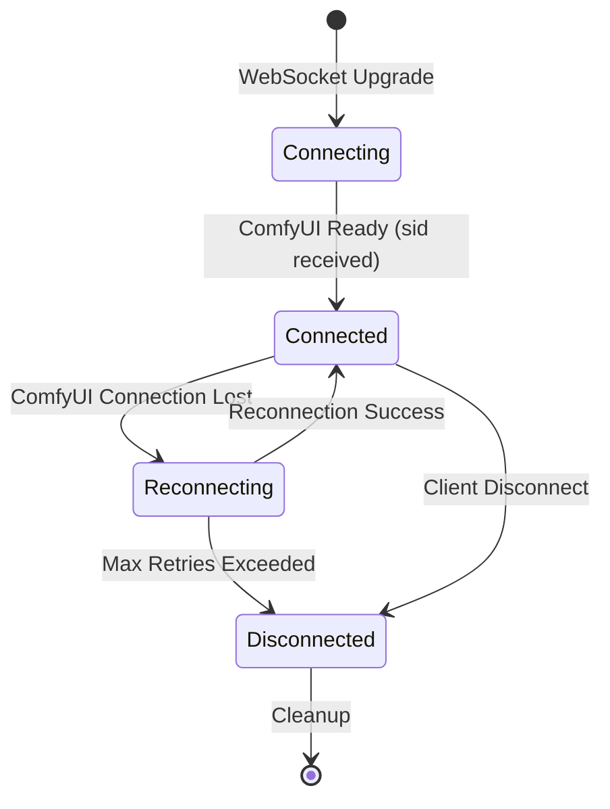
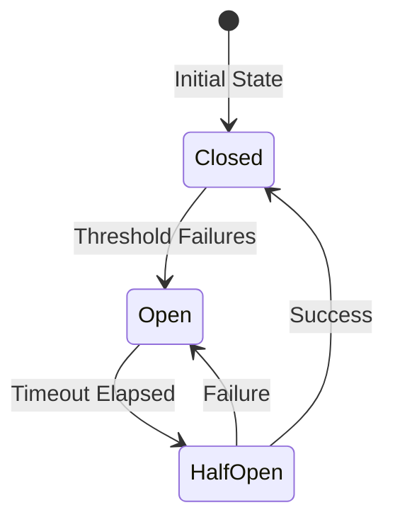
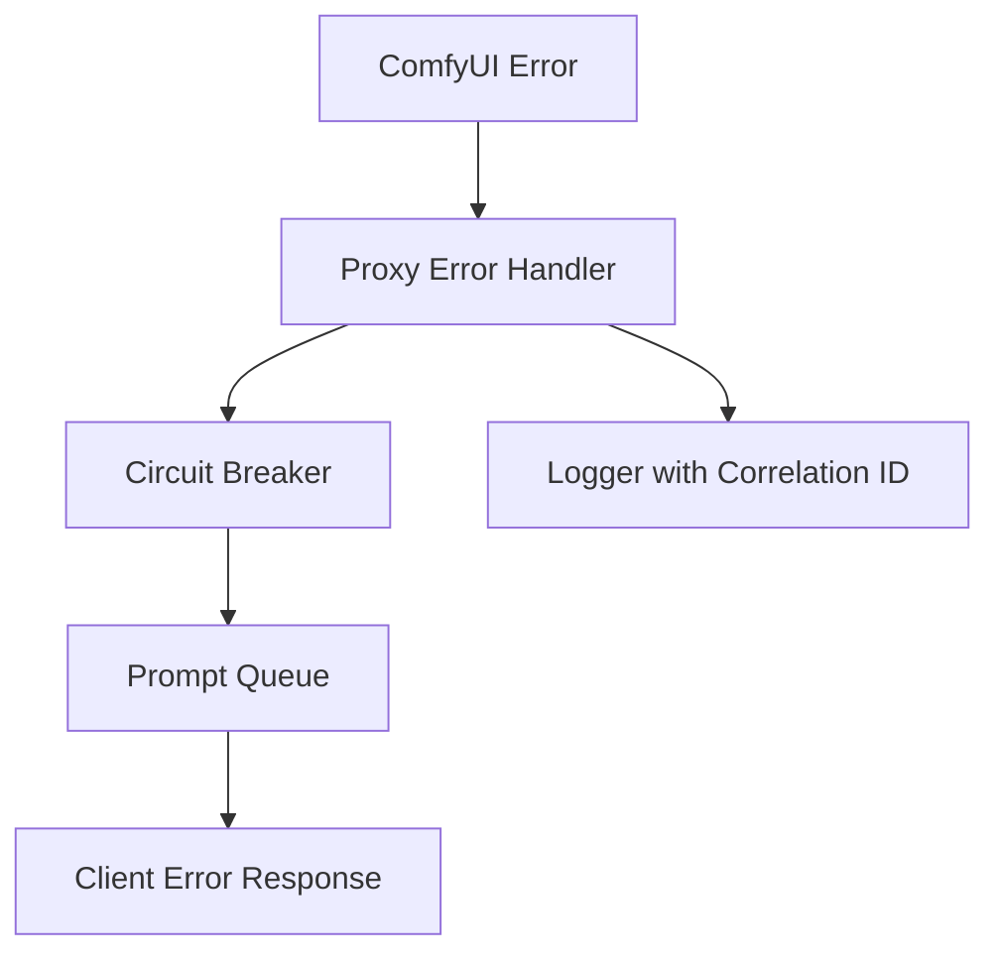

# @cj Packages Architecture

## Overview

The `@cj/` packages provide a TypeScript-based client-server architecture for interacting with ComfyUI, completely isolated from the Python codebase. This isolation enables easy rebasing on ComfyUI upstream.

## Package Structure

```
@cj/
├── comfy-auth/      # Shared JWT authentication utilities
├── comfy-client/    # WebSocket client for ComfyUI (Bun + Browser)
├── comfy-proxy/     # WebSocket proxy server with JWT auth
└── web/             # Browser test suite and development UI
```

## Package Dependencies



## Data Flow

### Client → Proxy → ComfyUI Flow



## Key Components

### @cj/comfy-auth

**Purpose**: Shared JWT authentication utilities

**Exports**:
- `verifyToken()` - Verify JWT tokens (HS256)
- `verifyAuthHeader()` - Verify Authorization header
- `generateJWT()` - Generate signed JWT tokens

**Dependencies**: `jsonwebtoken`

### @cj/comfy-client

**Purpose**: Universal WebSocket client for ComfyUI

**Key Features**:
- Universal adapter (works in Bun and Browser)
- Automatic reconnection with exponential backoff
- Heartbeat/ping support
- Tab focus reconnection (browser)
- Type-safe Result types
- Correlation ID support for logging

**Architecture**:
```
ComfyClient
├── WebSocketAdapter (abstract)
│   ├── UniversalWebSocketAdapter (Bun + Browser)
│   └── MockWebSocketAdapter (testing)
├── Logger (consola wrapper)
└── Error Handling (Result types)
```

**Dependencies**: `@cj/comfy-auth`, `consola`, `zod`

### @cj/comfy-proxy

**Purpose**: WebSocket proxy with JWT authentication

**Key Features**:
- Per-user ComfyUI WebSocket connections
- JWT authentication on WebSocket upgrade
- HTTP prompt submission to ComfyUI
- Real-time event proxying
- Circuit breaker for fault tolerance
- Prompt queuing during downtime
- Session management with cleanup
- Correlation ID generation and propagation

**Architecture**:
```
Proxy Server
├── WebSocket Handler
│   ├── Auth Verification (JWT)
│   ├── Session Management
│   └── Message Routing
├── Session Manager
│   ├── Session Storage
│   ├── Cleanup Timer
│   └── Connection Limits
├── Error Handling
│   ├── Circuit Breaker
│   ├── Prompt Queue
│   └── Retry Logic
└── Logger (consola with correlation IDs)
```

**Dependencies**: `@cj/comfy-auth`, `consola`, `zod`, `commander`

### @cj/web

**Purpose**: Browser testing and development UI

**Key Features**:
- Playwright E2E tests
- Bun integration tests
- React-based test UI
- Shared test utilities

**Dependencies**: `@cj/comfy-client`, `@cj/comfy-auth`, `@playwright/test`, React

## Logging Architecture

All packages use **consola** for logging with correlation ID support:



**Features**:
- Correlation IDs for request tracing
- Structured logging (objects in log context)
- Log levels: debug, info, warn, error, silent
- Tag/prefix support for filtering

## Session Management

The proxy maintains sessions with the following lifecycle:



**Session Properties**:
- `sessionId`: Composite key (`userId:clientId`)
- `correlationId`: UUID for request tracing
- `lastActiveAt`: Timestamp for cleanup
- `reconnectAttempts`: Counter for reconnection logic

## Error Handling

### Circuit Breaker Pattern



**States**:
- **Closed**: Normal operation, requests pass through
- **Open**: Circuit open, requests queued
- **Half-Open**: Testing recovery, limited requests allowed

### Error Propagation



## Testing Strategy

### Test Types

1. **Unit Tests**: Test individual components in isolation
   - Mock adapters for client tests
   - Mock ComfyUI for proxy tests

2. **Integration Tests**: Test package interactions
   - Client ↔ Proxy communication
   - Proxy ↔ ComfyUI communication (mocked)
   - Error propagation across boundaries

3. **E2E Tests**: Full system tests
   - Playwright browser tests
   - Bun integration tests with real proxy

### Test Utilities

Shared test utilities provide:
- JWT generation for tests
- Test prompt creation
- Performance measurement
- Event sequence validation
- Image validation

## Isolation from Python

**Key Principles**:
- ✅ No Python imports in `@cj/` packages
- ✅ No shared Python dependencies
- ✅ TypeScript-only codebase
- ✅ Workspace protocol for internal dependencies
- ✅ Can be moved to separate repository if needed

**Boundary**:
- `@cj/` packages communicate with Python ComfyUI via:
  - HTTP REST API (`/prompt` endpoint)
  - WebSocket protocol (ComfyUI's native protocol)
- No direct Python code dependencies

## Performance Considerations

### Connection Management
- Per-user ComfyUI connections reduce server load
- Connection pooling via session management
- Automatic cleanup of idle sessions

### Logging Performance
- Consola is optimized for performance
- Correlation IDs add minimal overhead
- Structured logging enables efficient log aggregation

### Error Handling Performance
- Circuit breaker prevents cascading failures
- Prompt queuing prevents request loss
- Exponential backoff reduces retry load

## Security

### Authentication
- JWT tokens verified on WebSocket upgrade
- HMAC-SHA256 (HS256) algorithm
- Token passed via query parameter (WebSocket limitation)

### Session Isolation
- Each user gets isolated session
- Sessions cannot access other users' data
- Automatic session cleanup prevents leaks

### Error Sanitization
- Detailed errors logged server-side
- Generic errors sent to clients
- No sensitive information leaked

## Monitoring

### Metrics Endpoint
- `/metrics` - Basic metrics (requires auth)
- `/metrics?detailed=true` - Detailed session info
- Protected by `METRICS_SECRET`

### Health Checks
- `/health` - Basic health check
- `/live` - Process alive check
- `/ready` - Ready to accept traffic

### Logging
- Correlation IDs enable request tracing
- Structured logging for log aggregation
- Performance metrics in logs

## Future Enhancements

1. **Shared Test Utilities Package**: Extract common test code
2. **Metrics Collection**: Add Prometheus/StatsD support
3. **Distributed Tracing**: Add OpenTelemetry support
4. **Rate Limiting**: Per-user rate limits
5. **WebSocket Compression**: Reduce bandwidth usage


